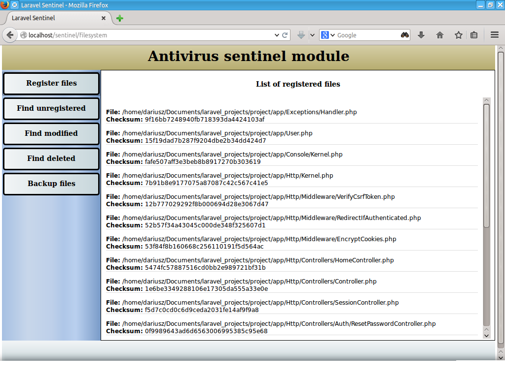
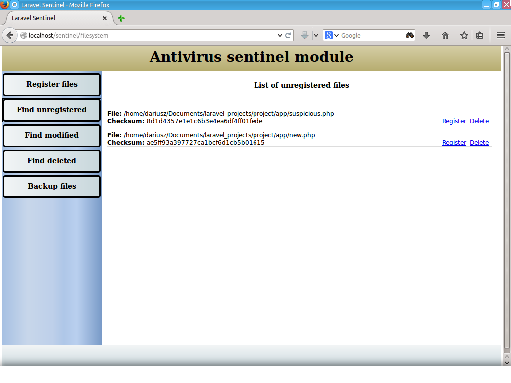
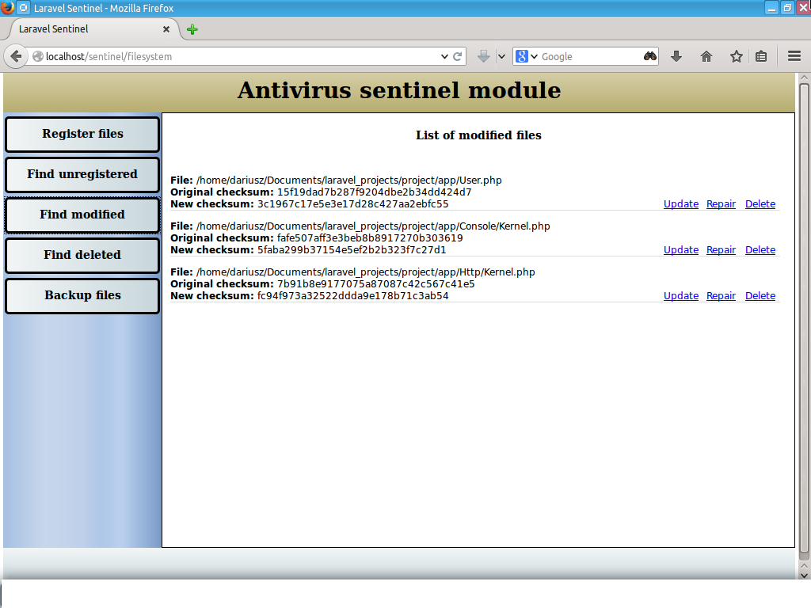
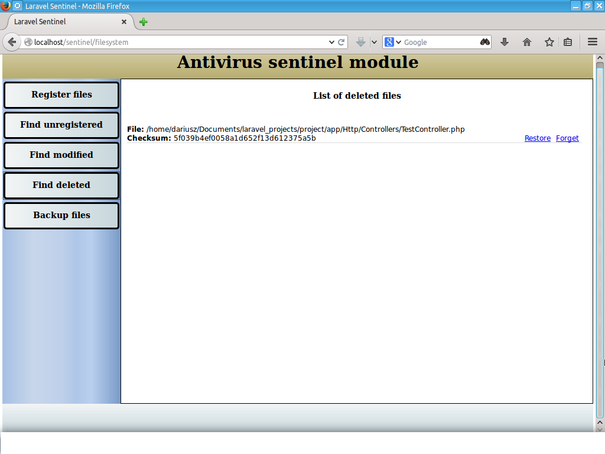

# Laravel Security

This module can be used to protect your application from potential modification
of PHP scripts for viruses and malware.

## Usage

 1. Enter: `http://yoursite.com/sentinel/filesystem`
 2. First register Your files
 3. Create backup
 4. Later find unregistered (not in list), deleted or modified files
 5. Restore backup
 6. Enjoy :-)

## To do

 1. Automatic scan, backup and restore
 2. Content comparing
 3. Database storage
 4. And more...

## Config


sentinel.php

```php
return [
    'filesystem' => [
        'directories' => [
            'scanned' => [
                app_path(),
            ],
            'backup' => storage_path('sentinel/filesystem/backup'),
            'logs' => storage_path('sentinel/filesystem/logs'),
            'quarantine' => storage_path('sentinel/filesystem/quarantine'),
        ],
        'ignored' => [
            'directories' => [
                storage_path(),
            ],
            'files' => [
                '.svn',
                '.git',
                '.gitignore'
            ]
        ],
        'compression' => [
            'type' => 'zip',
            'include_subfolders' => true,
            'params' => []
        ],
        'inspection' => [
            'checksum_storage' => [
                'type' => 'file',
                'directory' => storage_path('sentinel/filesystem/inspection'),
            ],
            'self_inspection' => true,
            'on_detection' => null,
            'caching'      => false,
            'cache_life'   => 1209600,
            'logging'      => true,
        ],
        'quarantine' => [
            'maxlife' => 604800,
            'gc' => 500
        ],
    ],
    'autoresponder' => [
        'driver' => 'email',
        'enabled' => true,
        'project_name' => 'Laravel APP',
        'email' => [
            'sender'    => 'sender@domain',
            'recipient' => 'recipient@domain',
            'mime_type' => 'text/html',
        ],
        'sms' => [
            'recipient' => 'your phone number',
        ],
    ]
];
```

## Example Screens









